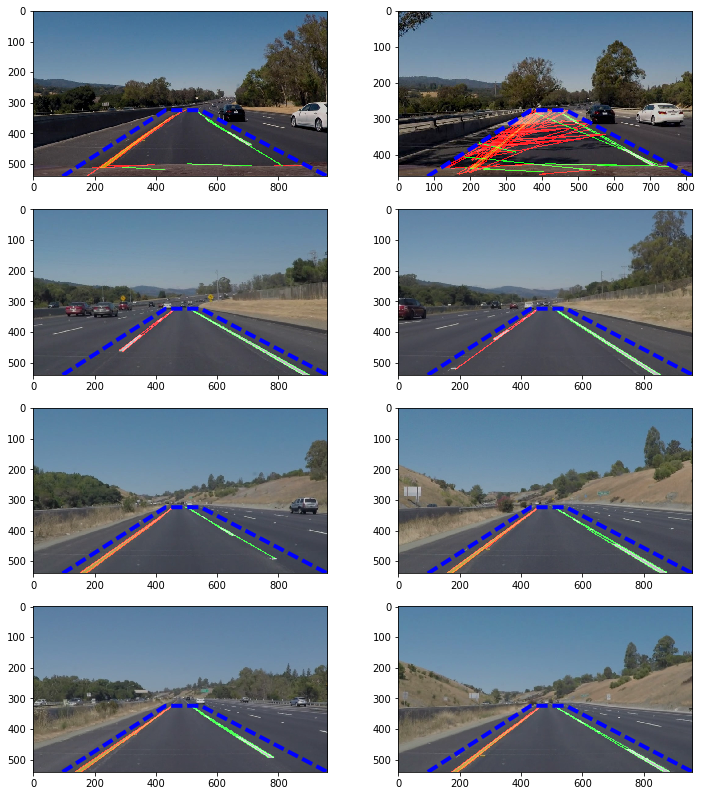
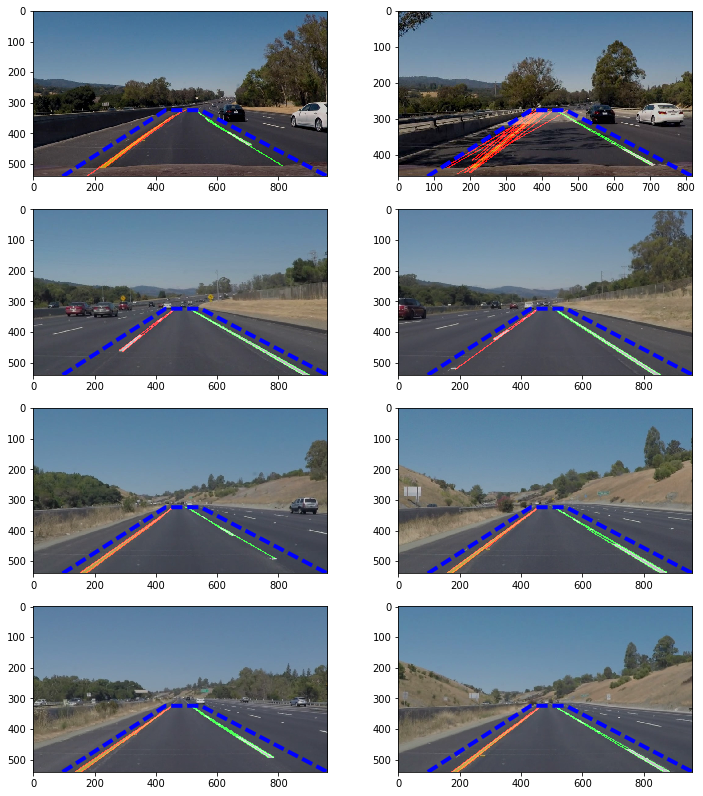
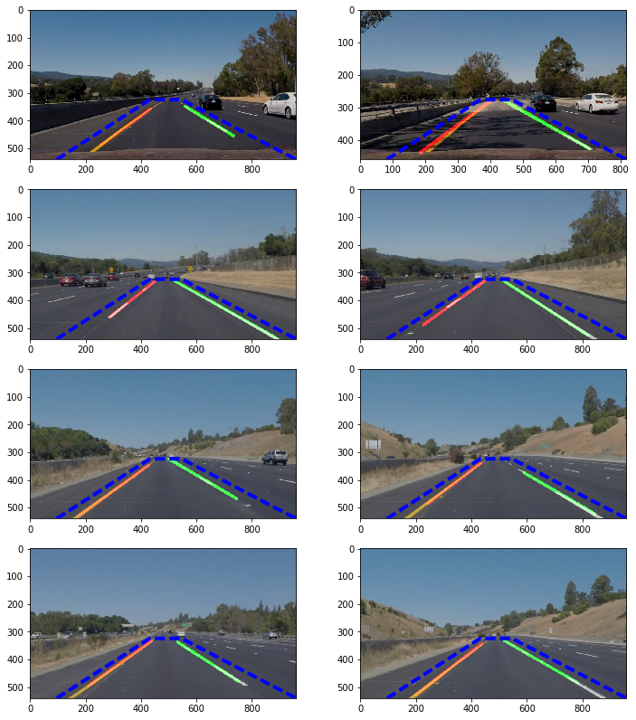
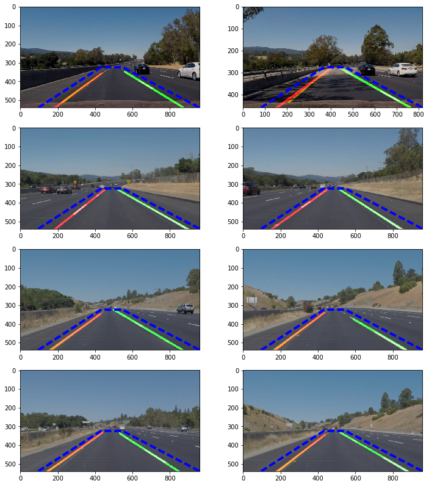

#**Finding Lane Lines on the Road** 

---

**Finding Lane Lines on the Road**

The goals / steps of this project are the following:
* Make a pipeline that finds lane lines on the road
* Reflect on your work in a written report

[//]: # (Image References)

[image1]: ./examples/grayscale.jpg "Grayscale"

---

### Reflection

###1. Describe your pipeline. As part of the description, explain how you modified the draw_lines() function.

My pipeline consisted of 7 steps:

1. Convert the images to grayscale.
2. Blur the image with gaussian blur.
3. Find edges with Canny algorithm.
4. Create a region of interest with the camera's perspective.
5. Apply Hough transform and get all visible lines under the region of interest.
6. Make adjustment to the lines (`draw_extrapolated_lines()`), which will output the extrapolated lines.
7. Combine the original image with extrapolated lines.

On the `draw_extrapolated_lines()` method, here is what I did:

#### 1. Group the lines together

Group the lines into left and right groups. This will result in the following screenshots (blue rectangle marks region of interest):

#### 2. Remove lines with lower slope

Low slopes means more horizontal lines. We do not want them, so remove from view. Results:

#### 3. Average lines

Average the remaining lines so we would end up with exactly two lines:

#### 4. Extrapolate lines

Extrapolate the lines so they go all the way to the bottom of the screen:

#### 5. Apply a learning algorithm to update lines

Instead of updating the lines directly, we update the lines from previous frame with

`new_xy=old_xy*(1-a)+xy*a` where:

- `new_xy`: New line's `x` or `y` coordinate.
- `old_xy`: Old line's `x` or `y` coordinate.
- `a`: Alpha or learning rate. The larger it is, the less information from old line that we keep.
- `xy`: `x` or `y` coordinate of extrapolated lines from step 4 above.

Doing this resulted in a smoother updates of the lines. When we don't get good captures of new lines 
the resulting lines won't be broken right away since they retain some information from the previous frames.

###2. Identify potential shortcomings with your current pipeline

One potential shortcoming would be what would happen when there are several frames where the algorithm could not
get good captures. This can be seen in some part of the challenge video.

Another shortcoming could probably be when the car is turning. The lines cannot currently have curves within them

###3. Suggest possible improvements to your pipeline

A possible improvement would be to automatically update the thresholds to capture better lines from images.

Another potential improvement could be to add a kind of polygonal to the lines, so they would support curves. I am not currently sure how to do it, though.